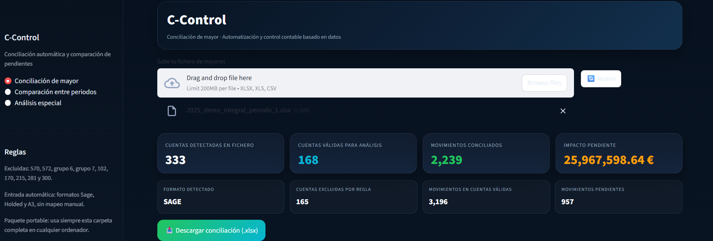
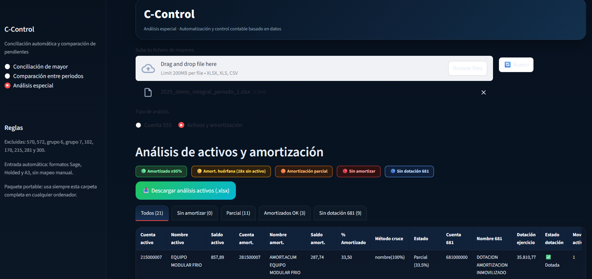

# C-Control

C-Control es una solución de control contable orientada a automatizar la conciliación de mayores, comparar incidencias entre periodos y analizar casos especiales de revisión financiera.

## Qué resuelve

En muchos entornos financieros, la revisión de mayores y pendientes sigue siendo manual, lenta y difícil de escalar.  
C-Control permite:

- conciliar movimientos automáticamente
- identificar partidas pendientes
- comparar pendientes entre periodos
- detectar duplicados y agrupaciones
- priorizar cuentas con mayor impacto
- analizar casos especiales como cuenta 555, activos, amortización y dotación 681

## Módulos principales

### 1. Conciliación de mayor
- conciliación automática 1:1, 1:N y N:1
- soporte para formatos SAGE, Holded y A3
- exportación Excel con detalle de conciliados, pendientes e incidencias

### 2. Comparación entre periodos
- detección de pendientes persistentes, corregidos y nuevos
- análisis de impacto económico
- identificación de duplicados exactos y pagos agrupados
- priorización de revisión por riesgo

### 3. Análisis especial — Cuenta 555
- conciliación interna de la cuenta 555
- cruces exactos con otras cuentas objetivo
- cruces semánticos para casos como préstamos y referencias compartidas
- exportación Excel específica para revisión

### 4. Análisis especial — Activos y amortización
- cruce entre activos y amortización acumulada
- identificación de activos sin amortizar o parcialmente amortizados
- detección de amortizaciones huérfanas
- revisión de dotación del ejercicio mediante cuenta 681

## Tecnologías utilizadas
- Python
- Streamlit
- Pandas
- OpenPyXL
- XlsxWriter

## Archivos principales
- `app_con_modo_comparacion_ccontrol_actualizado_v7_3.py`
- `engine.py`
- `comparison_engine_ccontrol_actualizado_v6_RECUPERADO.py`
- `excel_export.py`
- `excel_export_comparison_ccontrol_actualizado_v6_RECUPERADO.py`

## Ejecución local

Instala dependencias:

```bash
pip install -r requirements.txt

## Capturas de la aplicación

### Conciliación de mayor


### Análisis de activos y amortización

